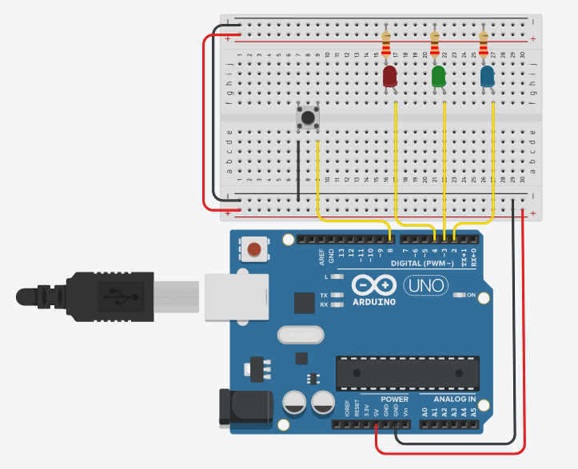

# Arduino - Whatsapp
## Interface de comunicação entre Arduino e Whatsapp

Esse projeto permite a integração Arduino - Whatsapp utilizando Python, juntamente com  Selenium e PySerial, como intermediador.

### Funções

* Envio de comandos ao Arduino através do Whatsapp (p.ex. acender leds)
* Emissão de alerta ao Whatsapp após o acionamento de sensores


### Requisitos

* biblioteca Selenium: 
```
pip install Selenium
```
* biblioteca PySerial:
```
pip install Pyserial
```
* Driver para comunicação entre o selenium e o navegador (após baixar, deve move-lo à mesma pasta que encontra-se o código python)
>> [Driver p/ Google Chrome](https://sites.google.com/a/chromium.org/chromedriver/downloads)<br>
>> [Driver p/ Firefox](https://github.com/mozilla/geckodriver/releases)<br>
>> [Driver p/ Edge](https://developer.microsoft.com/en-us/microsoft-edge/tools/webdriver/#downloads) <br>
>> [Driver p/ Opera](https://github.com/operasoftware/operachromiumdriver/releases)

### Circuito
A figura abaixo ilustra o circuito utilizado baseado no código-fonte  aqui fornecido:



Caso queira usar como base o mesmo circuito, será necessário ter posse dos seguintes componentes:

| Componente               | Quantidade |
|--------------------------|------------|
| LED                      | 3          |
| Resistor 220 ohms        | 3          |
| Chave táctil/Push button | 1          |

### Informações extras
* Por padrão o app busca por um contato/grupo de nome WhatsIno. Caso queira mudar, apenas altere o valor da variável Contato, presente em WhatsIno.py

### Contribuições
Estou aberto à criticas, dicas, conselhos etc. pois trata-se de meu primeiro projeto exposto publicamente, o qual elaborei como base para meu Trabalho de Conclusão de Curso do meu curso técnico em Desenvolvimento de Sistemas.

Em caso de dúvidas, contatar através de meu e-mail: me.dann010@gmail.com


